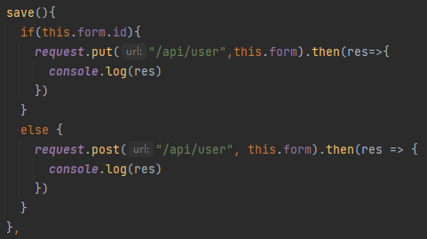
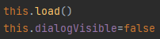
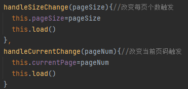
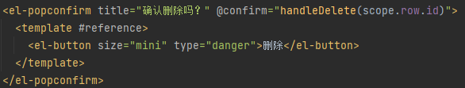

## 分页
后端controller中分页用到了Page类，Page类需要pagesize这个参数；而前端也定义了pagesize这个变量。那么每页多少条记录由谁决定？
如果是从前端访问，那么前端访问后端时会用前端的pagesize作为后端分页时Page类的pagesize参数，也就是说每页多少条记录由前端定死；而如果是直接访问后端接口，那么pagesize由url的参数决定。
## 弹窗

点击新增和编辑弹出的是同一个窗口，但是这两种场景下窗口的确定按钮应该对应不同的函数。因为点击新增后窗口的确定按钮对应的是向数据库新增数据的操作，而点击编辑后窗口的确定按钮对应的是编辑数据库数据的操作。因此确定按钮对应的函数需要有一个判断的逻辑。

点击确定按钮我们希望弹窗能够消失同时页面数据能够更新，因此在save方法的结尾处加上这两行。

我们希望在页面中切换当前页和每页个数时页面能正确显示数据。那么只需要我们在对应的函数中更改参数之后重新load即可。
## 删除操作

删除逻辑对应的按钮应该是确认弹窗的确认按钮而不是页面上的删除按钮，点击删除按钮仅仅弹出确认弹窗。
## controller参数的注解
@RequestParam
实际url里的参数来填充

@PathVariable
url模板来填充

@RequestBody
将请求体的内容封装成参数指定的类型